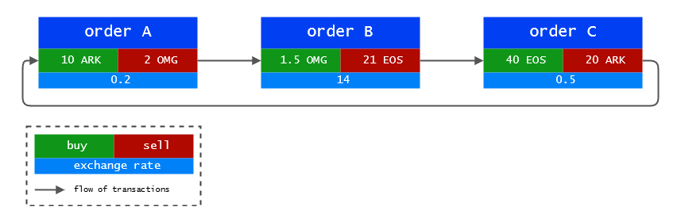
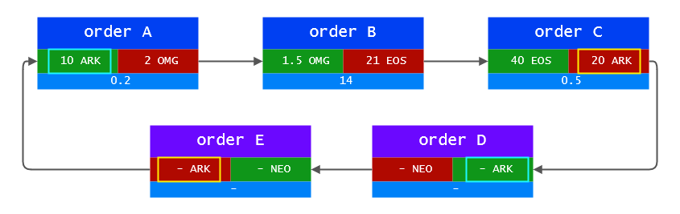

# Loopring Smart Contracts

The loopring smart contracts are a set of ethereum contracts that implement the loopring protocol. This document describes the functionnalities they provide and is structured as follows:

- [Management of orders](protocol.md#management-of-orders)
	- [Anatomy of an order](protocol.md#anatomy-of-an-order)
	- [Full or partial cancellation](protocol.md#full-or-partial-cancellation)
	- [Fill and cancellation amounts tracking](Fill-and-cancellation-amount-tracking)
- [Verification of miner supplied data](protocol.md#verification-of-miner-supplied-data)
	- [Order Ring](protocol.md#order-ring)
	- [Order Ring validation](protocol.md#order-ring-validation)
		- [Sub-loops](protocol.md#sub-loop-check)
		- [Fill rates](protocol.md#fill-rates-check)
- Ring settlement
	- Transactions
	- Fee model
- Emitted events

The code is open source and available on [github](https://github.com/Loopring/protocol).

The Loopring Smart Contracts will be refered as `LSC` in this document. You can read more about the calculations and formulas used in this page from the [whitepaper](https://github.com/Loopring/whitepaper/raw/master/en_whitepaper.pdf) and supersimmetry's {[da447m@yahoo.com](mailto:da447m@yahoo.com)} [Remarks on Loopring](../pdf/supersimmetry-loopring-remark.pdf). Please be noted that in the current protocol implementation, the pricing model is the same as in our whitepaper and the above document, but the fee model is different.

## Management of orders
To understand what the LSC does, we must first take a look at the definition of an order, the available actions for the user and how the current order state is tracked.

### Anatomy of an order
An order is a pack of data that describes the intent of the user on the market. To ensure the origin of the order, it is `signed against the hash of its parameters` with the user's private key. The signature is sent along the order on the network. This requires the order to stay `immutable` during its whole lifetime to verifiy the sender's address. 
`Signature = ECDSA(SHA3(order_params))`

Even if the order never changes, the LSC has the possibility to [compute its current state](protocol.md#computation-of-the-current-state-of-orders).

Relevant variables of an order's parameters:

| Data    |     Comment |
|---------|------- |
| tokenS  | Token to sell |
| tokenB  | Token to buy  |
| amountS | Amount of tokenS to sell |
| amountB | Amount of tokenB to buy  |
| buyNoMoreThanAmountB | see below |
| ttl | (time to live) Seconds after wich the order will expire |
| lrcFee | Max amount of LRC to pay to the miner |

The exchange rate `r` of the order is determined using the following formula `r = amountS/amountB`. When a miner does the ring-matching there is a possibility that he finds you a better rate that gets you more `tokenB` than the `amountB` you specified. But, if the `buyNoMoreThanAmountB` flag is set, the LSC will make sure that you still get exactly `amountB` of `tokenB`.

> **Example**: with `amountS = 10` and `amountB = 2`, `r = 10/2 = 5`. This means that you are willing to sell `5 tokenS for each tokenB`. The miner does the ring-matching and `finds you a rate of 4`, topping the amount he could get you to `2.5 tokensB instead of 2`. You only wanted 2 tokensB and set the `buyNoMoreThanAmountB flag to true`. The LSC takes that into consideration and still makes the transaction at a rate of 4 and you ended up selling `4 tokenS for each tokenB`, effectively `saving 2 tokenS`. Keep in mind that this does not take into account the miner fees.

### Full or partial cancellation
A user can partially or fully cancel an order by sending a special transaction to the LSC, containing the details about the order and the amounts to cancel. The LSC will take that into account and store the amounts to cancel and emit an `OrderCancelled` event to the network.

### Fill and cancellation amount tracking
The LSC keep track of fill and cancellation amounts by storing their values using the order's hash as an identifier. This data is publicly accessible and `OrderCancelled` and `OrderFilled` events are emitted when it changes.

This tracking is useful for the LSC during the [ring settlement]() step.

## Verification of miner supplied data
This section will talk about what the LSC expect to receive from the miners and the steps taken to verify the data.

### Order Rings
The LSC expect to receive order rings from the miners. An order ring is multiple orders linked together in a way that allows them to be all matched at their desired exchange rate or better. See the diagram below as an example.

Notice how each order's token to sell is the following order's token to buy. It creates a loop that allows each order to effectively sell and buy their desired tokens without having a matching order of the opposite pair. Of course this is not as simple as just making the tokens flow from an order to the other, some checks have to made to make sure that the original exchange rate of the order is respected.

The condition for a ring to be valid is that the product of the echange rate of all orders should be more or equal to 1.
>**Example**: Let's check if the above ring in the diagram is valid.
`0.2 * 14 * 0.5 = 1.4` the result is more than 1, thus the trade should be possible.

### Order Ring Validation
The LSC does not perform the exchange rate calulcations or amount but still has to verify what the miner supplied for these values. This is done by miners for two main reasons: solidity does not have support for floating point maths, especially `pow(x, 1/n)` and we want the math computation to be done off-chain to save gas.

The following section discusses mathematical validation of the order rings. We recommand you to check as a complementary supersimmetry's document listed at the beginning of this page.

#### Sub-loop check
This step prevents about [covered interest arbitrage](https://en.wikipedia.org/wiki/Covered_interest_arbitrage). Once a valid ring is found by a miner, he could be tempted to add other orders to it to achieve a zero-risk covered interest arbitrage.
This is considered as an unfair conduct from the miner in Loopring.

The diagram bellow illustrates the previous valid ring where 2 orders were added.

To prevent this, Loopring requires that **a verified loop cannot create a further sub-loop to continue trading**. There is a very simple way to check this: a `token cannot be twice in a buy or sell position`. In the above diagram we can see that ARK is twice as a token to sell and twice as a token to buy.

### Fill rates check